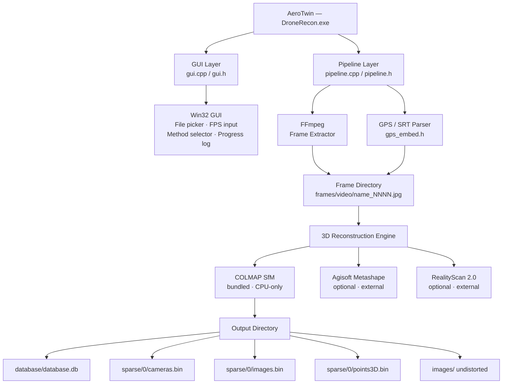
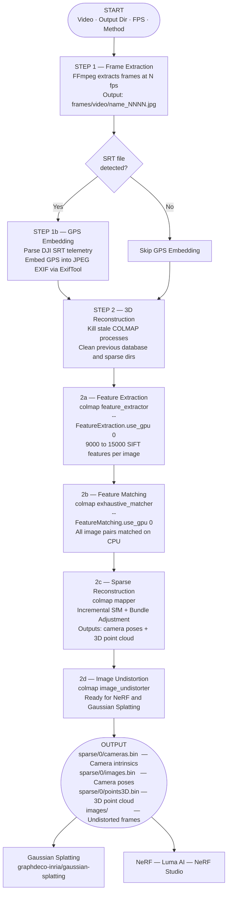

# AeroTwin — Drone Video to 3D Reconstruction Pipeline

<div align="center">


**Built for Hack With Vizag 2026 · Team Synapse X**

*Transform drone footage into photorealistic 3D digital twins — automatically.*

</div>

---

## Overview

**AeroTwin** converts raw drone video into a complete 3D reconstruction dataset ready for **Gaussian Splatting** and **NeRF** workflows.

- Frame extraction at configurable FPS via FFmpeg
- GPS coordinate embedding from DJI SRT telemetry
- COLMAP Structure-from-Motion (SfM) reconstruction
- Sparse 3D point cloud + camera pose generation
- Undistorted images ready for downstream AI pipelines

---

## Features

| Feature | Details |
|---------|---------|
| **Input** | MP4, AVI, MOV — any FFmpeg-supported format |
| **SRT GPS Embed** | Auto-detects DJI SRT, embeds GPS into JPEG EXIF |
| **Frame Extraction** | Configurable 1–30 fps via FFmpeg |
| **3D Reconstruction** | COLMAP SfM (CPU), Metashape, RealityScan 2.0 |
| **Output** | Point cloud, camera poses, undistorted images |
| **GUI** | Native Win32 — no install, no dependencies |

---

## Architecture



---

## Pipeline Flowchart



---

## Project Structure

```
AeroTwin/
├── src/
│   ├── main.cpp        WinMain entry point
│   ├── gui.cpp         Win32 GUI (window, controls, log)
│   ├── gui.h           GUI header
│   ├── pipeline.cpp    Core pipeline orchestration
│   ├── pipeline.h      Pipeline declarations and config
│   └── gps_embed.h     DJI SRT parser + EXIF GPS logic
├── vendor/             Populated at build time (not committed)
│   ├── ffmpeg/         FFmpeg static binary
│   ├── colmap/         COLMAP binary (CPU, no CUDA)
│   └── exiftool/       ExifTool binary
├── build/              CMake build output
├── CMakeLists.txt      Build config (MinGW / MSVC)
├── BUILD.md            Build instructions
├── CHANGELOG.md        Version history
├── LICENSE             MIT License
└── README.md           This file
```

---

## Prerequisites

| Tool | Version | Install |
|------|---------|---------|
| Windows | 10 / 11 x64 | — |
| GCC (MinGW) | 13+ | `scoop install gcc` |
| CMake | 3.20+ | `scoop install cmake` |
| Make | Any | `scoop install make` |
| FFmpeg | Latest | `scoop install ffmpeg` |
| ExifTool | Latest | `scoop install exiftool` |
| COLMAP (no-CUDA) | 4.2+ | [GitHub Releases](https://github.com/colmap/colmap/releases) |

> **Install Scoop** (no admin required):
> ```powershell
> Set-ExecutionPolicy RemoteSigned -Scope CurrentUser
> irm get.scoop.sh | iex
> scoop install gcc cmake make ffmpeg exiftool
> ```

---

## Build Instructions

```powershell
# Clone
git clone https://github.com/rohzyy/AeroTwin.git
cd AeroTwin

# Place vendor binaries
#   build/vendor/ffmpeg/bin/ffmpeg.exe
#   build/vendor/colmap/bin/colmap.bat + DLLs
#   build/vendor/exiftool/exiftool.exe

# Build
cmake -B build -G "MinGW Makefiles" -DCMAKE_BUILD_TYPE=Release .
cd build
make

# Run
.\DroneRecon.exe
```

See [BUILD.md](BUILD.md) for full step-by-step instructions.

---

## Usage

1. **Launch** `build/DroneRecon.exe`
2. **Select Video File** via the "File" button
3. **Select Output Directory** for results
4. **Set Frame Rate** — recommended `10.0` fps for a 5–10 s clip
5. **Choose Method** — select "COLMAP (bundled)"
6. **Click "Start Processing"** — takes ~10–15 min on CPU

### Output Files

After successful completion, your output directory will contain:

```
<output>/
├── frames/
│   └── <videoname>/
│       ├── <videoname>_frame_0001.jpg
│       └── ...
├── database/
│   └── database.db        COLMAP feature database
├── sparse/
│   └── 0/
│       ├── cameras.bin    Camera intrinsics
│       ├── images.bin     Camera extrinsics (poses)
│       └── points3D.bin   Sparse 3D point cloud
└── images/
    └── *.jpg              Undistorted images for NeRF/Splat
```

### Using Output with Gaussian Splatting

```bash
python train.py -s <output_directory>
```

---

## Technical Details

### SIFT Feature Extraction
Each frame yields ~9,000–15,000 SIFT keypoints at 1920×1080. COLMAP uses a `SIMPLE_RADIAL` camera model with focal length estimated from sensor metadata.

### Exhaustive Feature Matching
All image pairs are matched — suitable for short drone clips. For longer sequences, use `sequential_matcher` or `vocab_tree_matcher`.

### Incremental Structure-from-Motion
COLMAP finds the best initial image pair, then progressively registers all cameras with bundle adjustment at each step.

### CPU-Only Mode
AeroTwin passes `--FeatureExtraction.use_gpu 0` and `--FeatureMatching.use_gpu 0` ensuring compatibility on any Windows machine without a CUDA GPU.

---


## License

```
MIT License

Permission is hereby granted, free of charge, to any person obtaining a copy
of this software and associated documentation files (the "Software"), to deal
in the Software without restriction, including without limitation the rights
to use, copy, modify, merge, publish, distribute, sublicense, and/or sell
copies of the Software, and to permit persons to whom the Software is
furnished to do so, subject to the following conditions:

The above copyright notice and this permission notice shall be included in all
copies or substantial portions of the Software.

THE SOFTWARE IS PROVIDED "AS IS", WITHOUT WARRANTY OF ANY KIND, EXPRESS OR
IMPLIED, INCLUDING BUT NOT LIMITED TO THE WARRANTIES OF MERCHANTABILITY,
FITNESS FOR A PARTICULAR PURPOSE AND NONINFRINGEMENT. IN NO EVENT SHALL THE
AUTHORS OR COPYRIGHT HOLDERS BE LIABLE FOR ANY CLAIM, DAMAGES OR OTHER
LIABILITY, WHETHER IN AN ACTION OF CONTRACT, TORT OR OTHERWISE, ARISING FROM,
OUT OF OR IN CONNECTION WITH THE SOFTWARE OR THE USE OR OTHER DEALINGS IN THE
SOFTWARE.
```

---


<div align="center">
Made with love by Team Synapse X for Hack With Vizag 2026
</div>
