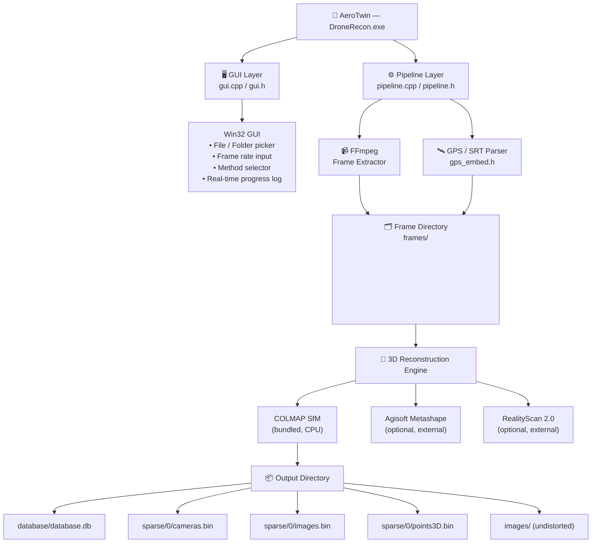
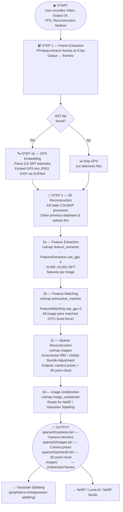

# AeroTwin — Drone Video to 3D Reconstruction Pipeline

<div align="center">


**Built for Hack With Vizag 2026 | Team Synapse X**

*Transform drone footage into photorealistic 3D digital twins — automatically.*

</div>

---

## Overview

**AeroTwin** is a Windows desktop application that converts raw drone video footage into a complete 3D reconstruction dataset ready for **Gaussian Splatting** and **Neural Radiance Fields (NeRF)** workflows.

Point AeroTwin at any drone video file, set a frame rate, and it handles everything:
- Frame extraction at the specified FPS via FFmpeg
- GPS coordinate embedding from DJI SRT telemetry files
- COLMAP-based Structure-from-Motion (SfM) 3D reconstruction
- Sparse 3D point cloud and camera pose generation
- Image undistortion ready for downstream AI/3D pipelines

---

## Features

| Feature | Details |
|---------|---------|
| **Input** | MP4, AVI, MOV, and any FFmpeg-supported format |
| **SRT GPS Embed** | Auto-detects DJI SRT telemetry and embeds GPS into EXIF |
| **Frame Extraction** | Configurable FPS (1–30 fps) via FFmpeg |
| **3D Reconstruction** | COLMAP SfM (CPU), Agisoft Metashape, RealityScan 2.0 |
| **Output** | Sparse point cloud, camera poses, undistorted images |
| **GUI** | Native Win32 GUI — no dependencies, no install required |

---

## Architecture



---

## Pipeline Flowchart



---

## Project Structure

```
AeroTwin/
├── src/
│   ├── main.cpp          — WinMain entry point
│   ├── gui.cpp           — Win32 GUI: window, controls, progress log
│   ├── gui.h             — GUI header
│   ├── pipeline.cpp      — Core pipeline: FFmpeg, COLMAP, ExifTool orchestration
│   ├── pipeline.h        — Pipeline function declarations & config
│   └── gps_embed.h       — DJI SRT parser + EXIF GPS embedding logic
├── vendor/               — (populated at build time, not committed)
│   ├── ffmpeg/           — FFmpeg static binary
│   ├── colmap/           — COLMAP binary (CPU, no CUDA required)
│   └── exiftool/         — ExifTool binary
├── build/                — CMake build output
├── CMakeLists.txt        — Build config (MinGW / MSVC)
├── BUILD.md              — Detailed build instructions
├── CHANGELOG.md          — Version history
├── LICENSE               — MIT License
└── README.md             — This file
```

---

## Prerequisites

| Tool | Version | Install |
|------|---------|---------|
| Windows | 10 / 11 x64 | — |
| GCC (MinGW) | 13+ | `scoop install gcc` |
| CMake | 3.20+ | `scoop install cmake` |
| Make | Any | `scoop install make` |
| FFmpeg | Auto | `scoop install ffmpeg` |
| ExifTool | Latest | `scoop install exiftool` |
| COLMAP (no-CUDA) | 4.2+ | [GitHub Releases](https://github.com/colmap/colmap/releases) |

> **Install Scoop** (no admin required):
> ```powershell
> Set-ExecutionPolicy RemoteSigned -Scope CurrentUser
> irm get.scoop.sh | iex
> scoop install gcc cmake make ffmpeg exiftool
> ```

---

## Build Instructions

```powershell
# 1. Clone the repo
git clone https://github.com/rohzyy/AeroTwin.git
cd AeroTwin

# 2. Place vendor binaries into build/vendor/
#    FFmpeg  → build/vendor/ffmpeg/bin/ffmpeg.exe
#    COLMAP  → build/vendor/colmap/bin/colmap.bat + DLLs
#    ExifTool→ build/vendor/exiftool/exiftool.exe

# 3. Configure and build
cmake -B build -G "MinGW Makefiles" -DCMAKE_BUILD_TYPE=Release .
cd build
make

# 4. Run
.\DroneRecon.exe
```

See [BUILD.md](BUILD.md) for detailed step-by-step instructions.

---

## Usage

1. **Launch** `build/DroneRecon.exe`
2. **Select Video File** — click "File" and pick your drone `.mp4`
3. **Select Output Directory** — where results will be saved
4. **Set Frame Rate** — recommended `10.0` fps for a 5–10 s clip
5. **Choose Method** — select "COLMAP (bundled)"
6. **Click "Start Processing"** — wait ~10–15 min on CPU

### Output Files

```
<output>/
├── frames/<videoname>/
│   ├── <videoname>_frame_0001.jpg
│   └── ...
├── database/
│   └── database.db          ← COLMAP feature database
├── sparse/
│   └── 0/
│       ├── cameras.bin      ← Camera intrinsics
│       ├── images.bin       ← Camera extrinsics (poses)
│       └── points3D.bin     ← Sparse 3D point cloud
└── images/
    └── *.jpg                ← Undistorted images
```

### Using Output with Gaussian Splatting

```bash
python train.py -s <output_directory>
```

---

## Technical Details

### SIFT Feature Extraction
Each frame yields ~9,000–15,000 SIFT keypoints at 1920×1080. COLMAP uses a `SIMPLE_RADIAL` camera model with focal length estimated from sensor metadata.

### Exhaustive Feature Matching
All image pairs are matched — appropriate for short video clips. For longer sequences, `sequential_matcher` or `vocab_tree_matcher` should be used instead.

### Incremental Structure-from-Motion
COLMAP finds the best initial image pair, then progressively registers all cameras using bundle adjustment at each step.

### CPU-Only Mode
AeroTwin passes `--FeatureExtraction.use_gpu 0` and `--FeatureMatching.use_gpu 0` to ensure compatibility on any Windows machine without a CUDA GPU.

---

## Team

**Team Synapse X** — Hack With Vizag 2026

| Name | Role |
|------|------|
| **Rohan Malyadri** | Lead Developer & Architecture |

---

## License

```
MIT License
Copyright (c) 2026 Rohan Malyadri — Team Synapse X
```

See [LICENSE](LICENSE) for the full text.

---

<div align="center">
Made with ❤️ by Team Synapse X for Hack With Vizag 2026
</div>
